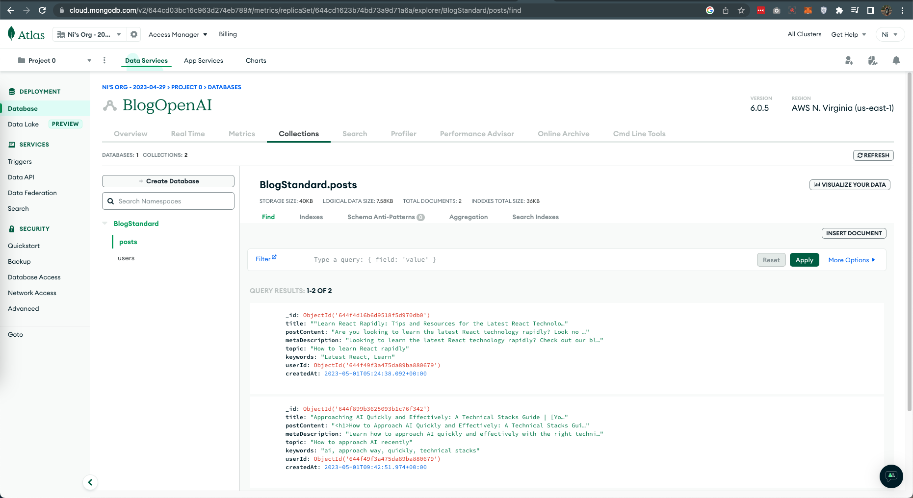
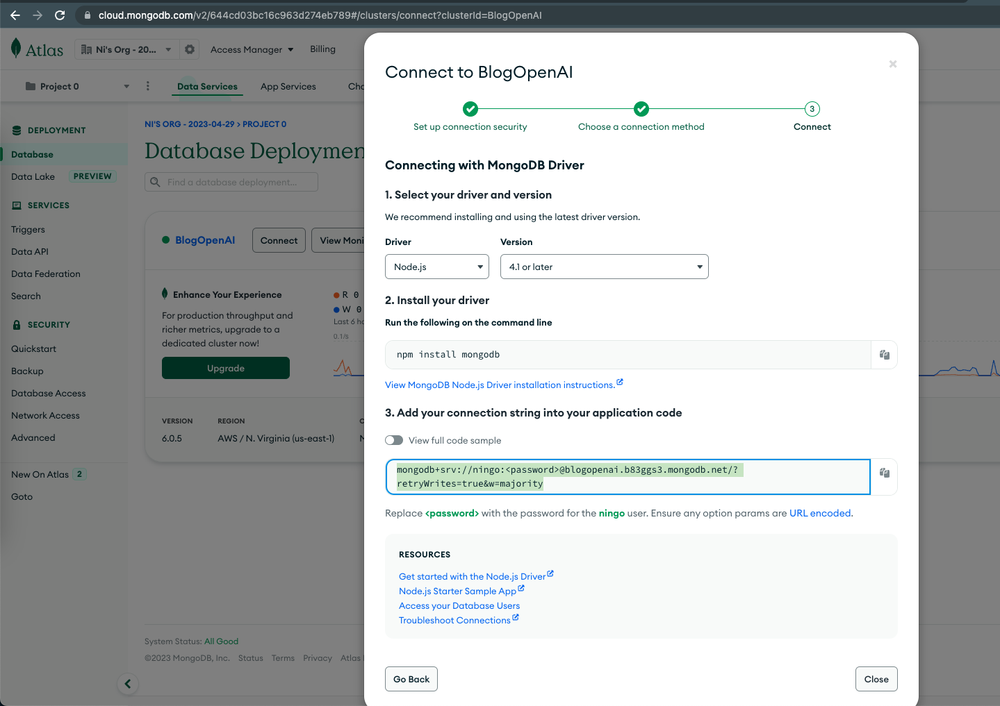

# Blog Post with Next.js and OpenAI
This is POC for course from Udemy: [link](https://www.udemy.com/course/next-js-ai/)

## Live demo
[https://nextjs-openai-brown.vercel.app/](https://nextjs-openai-brown.vercel.app/)
## Technical Stack
- [Next.js](https://www.npmjs.com/package/next): v13.3.2
- [React](https://www.npmjs.com/package/react): v18.2.0
- [MongoDB](https://www.npmjs.com/package/mongodb): v5.3.0
- [Nextjs-Auth0](https://www.npmjs.com/package/@auth0/nextjs-auth0): v2.5.0
- [OpenAI](https://www.npmjs.com/package/openai): v3.2.1
  
## How to run source code
### Register accounts
Before running this source code, you need to make sure that you created accounts and get necessary keys for this web app:
1. **OpenAI**

- Please go to https://platform.openai.com/ and register account. 
- You need to make sure to use fake VPN if you are in Vietnam.
- Buy one US phone number to receive OTP code from OpenAI. It only costs around $0.5 per one.
- Finally, you can go to https://platform.openai.com/account/api-keys to get key
  
2. **Auth0**

- Please go to https://auth0.com/ and register account.
- Finally, you can go to [Dashboard](https://manage.auth0.com/dashboard/us/<user_id>/applications/<your_app_id>/settings) to get Domain, Client ID and Client Secret keys
- To generate Auth0 Secret Private key, you can use this command:

```
openssl rand -hex 32
```

3. **MongoDB**

- Please go to https://cloud.mongodb.com/ and register account
- Then, create Database with name `BlogStandard`
- Create 2 collections: `posts` and `users`. You can check below 
- When you click Connect, you can get MONGODB_URI then fill up the password in env file. You can check 
### Fill up keys
Please create a file `.env.local` in root directory and fill up these values:

```
AUTH0_SECRET=
AUTH0_BASE_URL=<Your app Domain>
AUTH0_ISSUER_BASE_URL=<Auth0 Domain>
AUTH0_CLIENT_ID=<Auth0 Client ID>
AUTH0_CLIENT_SECRET=<Auth0 Client Secret>
MONGODB_URI=mongodb+srv://<your_user>:<your_password>@<database_name>.mongodb.net/?retryWrites=true&w=majority
OPEN_API_KEY=
```

Locally, you can set:
```
AUTH0_BASE_URL=http://localhost:3000
```

### Available commands
| Command                | Action                                            |
| :--------------------- | :------------------------------------------------ |
| `npm install`          | Install dependencies                              |
| `npm run dev`          | Start local dev server at `localhost:3000`        |
| `npm run build`        | Build your production site to `./.next/`           |
| `npm run clean`        | Remove `node_modules` and build output            |
